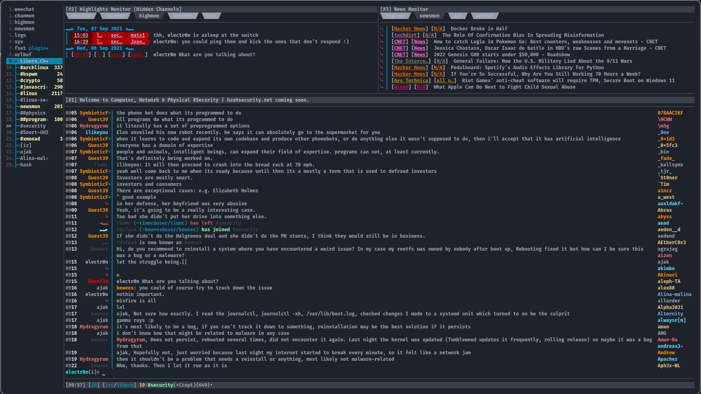

<h3 align="center">


Whatever it is you think you see, your setup was just pwned by me!!
</h3>

   * [Introduction](#introduction)
   * [Management](#Management)
   * [System](#System)
      * [Approach](#Approach)
      * [GTK/colorscheme](#Colorscheme)
      * [Environment](#Environment) 
      * [Software](#Software)
         * [Slack](#Slack)
         * [TelegramDesktop](#TelegramDesktop)
         * [Lightcord](#Lightcord)
      * [TMUX](#tmux)
         * [Plugins](#plugins)
         * [Keybindings](#keybindings)
      * [ZSH](#zsh)
      * [FZF](#fzf)

 
## Introduction 

In this repo you will find my various dotfiles for your consumption. These days I find myself using various virtualized deployments that I needed to standarize my environment and make it easy to reproduce with as little a headache as possible.(read: minimal effort). I recently moved my workflow to only using a 
Tiling window manager such as Xmonad and bspWM with keybindings to complete most tasks including app launching/navigation. I believe that your desktop configuration should definitely be personalized/customized to not only streamline your workflow but it should look good damnit. 


## Management 

Currently using stow for management of my dotfiles. You can clone this repository and use it to adopt my config to your system. This won't be the case for much longer as I am moving the workflow over to a Makefile to automate setting up my entire environment and not just the dotfiles. (Sept '21).  

## System 

Host: HP EliteDesk 800 G4 TWR <br>
OS: ArchLinux Kernel 5.13.5-arch-1 <br>
Disks: { rootfs 1tb nvme ssd.  ~/data 1tb nvme ssd. ~/datasets 1tb sata ssd. } <br>
Memory: 32gb DDR3 2600mhz 4x8GB. <br>
Shell: zsh / nushell <br>
WM: XMonad <br>
Taskbar: Polybar <br> 


### Approach  

I believe your desktop environment should be a representation of YOU and customized accordingly. Personally I choose to run a standalone Tiling Window Manager, called XMonad. It's only concern is managing the windows. From that point I can pick and choose which functionality I want to implement to mimic a full-blown desktop environment. This repo also includes a setup for BSPWM but I ultiimately always end up back on XMonad. 

### Colorscheme

Currently I am utilizing a customized version of base16_onedark. I prefer using a darker color for my background and employ that system wide. Not having a consistent/unified look
system wide would bother me, so the software I utilize tends to be highly customizable and fits into the general aestetics of my setup. These are the colors being utilized system wide. 
The onedarkish GTK theme uses the same colors as found in .Xresources. In this repo you will also see .Xresources.d which contain Xresources file for other popular colorschemes. 

OneDark: 

`
#define base00 #1e222a
##define base00 #1b1e23
#define base01 #353b45
#define base02 #3e4451
#define base03 #545862
#define base04 #565c64
#define base05 #abb2bf
#define base06 #b6bdca
#define base07 #c8ccd4
#define base08 #e06c75
#define base09 #d19a66
#define base0A #e5c07b
#define base0B #98c379
#define base0C #56b6c2
#define base0D #61afef
#define base0E #c678dd
#define base0F #be5046
`

### Environment 

As stated above, I run the best standalone TWM, XMonad. These are facts, trust me. In an effort to streamline my workflow and to provide certain 
conveniences, I run several applets and other to provide the certain functionality you'd come to expect on a modern desktop environment. The beauty of
this approach is that you can choose (read: control) what is going to be installed/running in your environment. Love XFCE but don't like Thunar? No problem,
install caja or ranger or BOTH!. The flexibility in starting with a base install (600~ pkgs) and deploying only your necessary (required?) packages to satisfy
your workflow is what the desktop experience should be all about. The only next logical step is to automate the whole process via a `Makefile`.  With all that said, this is the core for my daily driver. 

### Software 

| Task            | Application               |  Riced    |
| ------------    | ------------------------  | --------  |
| Notifications   | Dunst                     | [x]       |
| Polkit          | gnome-polkit-agent-1      | [ ]       |
| Taskbar         | Polybar + polywins        | [x]       |
| Connectivity    | NetworkManager applet     | [ ]       |
| Audio Control   | VolumeIcon + PipeWire     | [ ]       |
| BT Peripherals  | Bluez / blueman-applet    | [ ]       |
| Launcher        | rofi                      | [x]       |
| Terminal        | Kitty / St                | [x]       |
| Shell           | zsh(ohmyzsh) + nushell    | [x]       |
| passwd mgmt     | self-hosted bw  + rofi    | [x]       |
| Tasks mgmt      | todo.sh + rofi            | [x]       |
| Logs            | lnav                      | [ ]       |
| Calendar        | remind + gcalcli          | [ ]       |
| Clipboard       | greenclip w/ rofi         | [x]       |
| Email           | AERC                      | [x]       |
| Editor          | nvchad / goneovim         | [x]       |
| KnwBase/Notes   | Obisidan.md + gitbook     | [x]       |
| File mgmt       | Ranger / thunar           | [x]       |
| Process         | bpytop / fzf+xargs+pkill  | [x]       |
| IRC             | Weechat (custom theme)    | [ ]       |


#### Weechat 

I wish I could take any credit for the look and functionality of my weechat setup but all i did was change colors around and excluded some functionality I did 
not require. Please refer to this [Github Gist](https://gist.github.com/pascalpoitras/8406501) by pascalpoitras. My changes came out looking like: 



#### Slack 

You can copy/paste the following code to apply my custom OneDark colorscheme to the slack-desktop client under Settings -> Theme. 

`#1E222A,#2F343D,#2F343D,#ABB2BF,#2F343D,#ABB2BF,#98C379,#98C379,#2F343D,#ABB2BF`

You shall end up with something similar to: 


#### TelegramDesktop 

While this is very much still a BIG work in progress, I believe it is usuable to the point that others may want to implement in their environments. Again if you encounter any issues or similar please don't hesitate to open an issue or reach out. 


Within this repo, the major sections (xmonad / bspwm / oh-my-zsh ) all will have individual readme's that describe in better detail my setup.


#### Lightcord 

I leveraged dark-discord.css theme to create a custom onedark style theme for Lightcord. You can find it in .config/lightcord/themes. You'll need to apply it using the Custom CSS section in settings. 


#### TMUX 

Locally I use kitty which has multiplexer functionality built right in but when I am logged into any server I have a standard TMUX configuration. I use TPM to manage plugins and have custom keybindings for some things to make my life easier. Since I map caps to esc and/or ctrl I use ctrl+a (so I can hit caps+a) as my TMUX prefix. 

##### Plugins 

tmux-plugins::
<ul>
	<li> tmux-sensible</li>
    <li> tmux-copycatM</li>
    <li> tmux-yank</li>
    <li> tmux-open</li>
</ul>
other:: 
<ul>
<li>laktak/extrakto (requires fzf)</li>
<li>thewtex/tmux-mem-cpu-load</li>
</ul>

I use a custom status line which mimics galaxyline from NvChad. Of course it as well uses onedark colors. 
	
I also use vim-tmux-pilot by sourcing pilot.tmux from my tmux config. This is installed via packer within nvim environment. 


##### Keybindings

| Keys                           | Command          |
|--------------------------------|-------------------|
| <kbd>Ctrl</kbd>+<kbd>A</kbd>   | send-prefox       |
| <kbd>Ctrl</kbd>+<kbd>Y</kbd>	 | sync panes 	  	 |
| <kbd>x</kbd>			  		       | kill-pane 		     |
| <kbd>X</kbd>			 		         | kill-window 	   	 |
| <kbd>_</kbd>			  		       | split-window -v 	 |
| <kbd> \| </kbd>		 		         | splint-window -h  |
| <kbd>z</kbd> 		 			         | resize-pane -Z    |
| <kbd>-</kbd> 		 		        	 | resize-pane -D 20 |
| <kbd>+</kbd> 		 		        	 | resize-pane -U 20 |
| <kbd>  "<" </kbd>           	 | resize-pane -L 20 | 
| <kbd> ">" </kbd> 		 		       | resize-pane -R 20 |


## ZSH 

I run zsh as my shell. I manage the environment using oh-my-zsh with various plugins. I make heavy use of fzf 
as I prefer to interact with my system via a CLI. The list of preferred applications I listed above should
have shed some light on that preference  . 

I deploy my zsh configuration to $ZSH_CUSTOM as this directory is automatically sourced by oh-my-zsh at startup and ignored during updates. 
Here you will find my custom zsh prompt theme based off of `afowler`. I add a custom RPROMPT for short-name of host,  keep the sections the 
same order but add colors and initial Arch icon. The next steps would be to finalize agonzal.zsh-theme as an actual prompt.conf to
give myself the ability of removing oh-my-zsh dependency altogether and easily load via `prompt -s agonzal`. 

I prefer to split my config across multiple files, this makes for a much cleaner `zshrc` and the filenames leave no room for interpretation. 
In this repo you'll find `ohmyzsh` directory containing: 

- README.md 
- functions.zsh
- aliases.zsh 
- forgit.plugin.zsh 
- greet.zsh 
- exports.zsh 

Currently, my zsh startup time with ohmyzsh is: 

`0.21s user 0.04s system 108% cpu 0.226 total`

For a more in-depth breakdown please refer to the [README.md](/ohmyzsh/README.md) in ohmyzsh directory. 


### FZF 

I use fzf for several ops. I use its `--preview` option to get a preview for packages available and description for installation (check yi alias in ohmyzsh/custom/aliases.zsh). The same goes for `pacrm` alias which uses to preview list all available packages and removes a selection. The default bindings for zsh will also use fzf for history, file searches. Nvim's telescope also uses fzf. It will look like: 


Please refer to the various aliases and exports within my zsh config for more details. Right now the default opts for fzf in this
setup are:

```shell
export FZF_DEFAULT_OPTS='
  --color fg:#6f737b,bg:#21252d
  --color bg+:#adc896,fg+:#282c34,hl:#abb2bf,hl+:#1e222a,gutter:#282c34
  --color pointer:#adc896,info:#abb2bf,border:#565c64
  --border'
```
